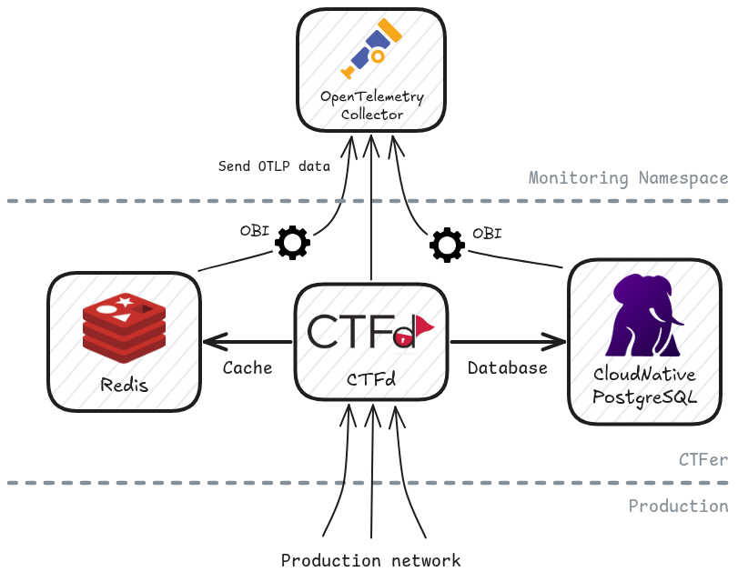

<div align="center">
  <h1>CTFer</h1>
  <a href="https://pkg.go.dev/github.com/ctfer-io/ctfer"></a>
  <a href="https://goreportcard.com/report/github.com/ctfer-io/ctfer"></a>
  <a href="https://coveralls.io/github/ctfer-io/ctfer?branch=main"></a>
  <br>
  <a href=""></a>
  <a href="https://github.com/ctfer-io/ctfer/actions?query=workflow%3Aci+"></a>
  <a href="https://github.com/ctfer-io/ctfer/actions/workflows/codeql-analysis.yaml"></a>
  <br>
  <a href="https://securityscorecards.dev/viewer/?uri=github.com/ctfer-io/ctfer"></a>
</div>

The _CTFer_ component is in charge of the production-ready deployment of a CTF platform (CTFd) along its cache (Redis), database (PostgreSQL) and support of OpenTelemetry, in a Kubernetes environment.

<div align="center">
  
</div>

> [!CAUTION]
>
> This component is an **internal** work mostly used for development purposes.
> It is used for production purposes too, i.e. on Capture The Flag events.
>
> Nonetheless, **we do not include it in the repositories we are actively maintaining**, and is subject to future major changes with no migration capability.

## 📦 Deployment

### Configuration

The default configuration will work, but you might not end up with a ✨ _perfect_ 🤌 setup.

To do so, you can look at the whole [`Pulumi.yaml`](Pulumi.yaml) configuration.
We detail some of them here.

#### Custom images

If you want to use custom images of CTFd (e.g., with your plugins or theme).

```bash
pulumi config set --path platform.image ctferio/ctfd:3.8.1-0.9.0
```

#### Configure [Chall-Manager](https://github.com/ctfer-io/chall-manager) URL

If you want to configure the ChallManager URL.

```bash
pulumi config set chall-manager-url http://chall-manager-svc.ctfer:8080/api/v1
```

#### Custom Certificate

If you want to use a custom certificate.
We **HIGHLY** recommend it for production purposes, especially to avoid MitM attacks, credentials leakage and so on.

```bash
# export PULUMI_CONFIG_PASSPHRASE before
# https://github.com/pulumi/pulumi/issues/6015
cat /path/to/crt.pem | pulumi config set --secret --path platform.crt
cat /path/to/key.pem | pulumi config set --secret --path platform.key
```

#### Filesystem

If you want to have a larger filesystem, for instance for uploads on CTFd.

```bash
pulumi config set --path plateform.storage-size 10Gi
```

#### Workers and Replicas

If you want to configure several workers on CTFd.

```bash
pulumi config set --path platform.workers 3
pulumi config set --path platform.replicas 3
```

> [!WARNING]
> You will need a ReadWriteMany compatible CSI (e.g., Longhorn) if the Pods are scheduled on several nodes
> ```bash
> pulumi config set --path platform.pvc-access-modes[0] ReadWriteMany
> pulumi config set --path platform.storage-class longhorn
> ```

#### Requests and Limits

If you want to configure other resources than default.

```bash
pulumi config set --path platform.requests.cpu 1
pulumi config set --path platform.requests.memory 2Gi

pulumi config set --path platform.limits.cpu 1
pulumi config set --path platform.limits.memory 1Gi
```

If you don't need air-gap settings, you can **directly skip to [the deployment](#lets-do-it)**.

### Air-gap environments

Requirements:
- [Hauler](https://docs.hauler.dev)

First of all, synchronize and your manifest with existing setup (e.g. online mock infrastructure).

```bash
cd hack
hauler store sync -f hauler-manifest-ha.yaml
hauler store copy registry://registry.dev1.ctfer-io.lab
```

Then, configure your Pulumi stack.

```bash
pulumi config set images-repository registry.dev1.ctfer-io.lab
pulumi config set charts-repository oci://registry.dev1.ctfer-io.lab/hauler
```

### Let's do it!

Now the last-mile for infrastructure-specific configuration, and you should be good to deploy CTFer! 💪

```bash
pulumi config set --path platform.hostname ctfd.dev1.ctfer-io.lab
pulumi config set --path ingress-labels.name traefik
pulumi config set --path db.operator-namespace cnpg-system
pulumi up 
```
